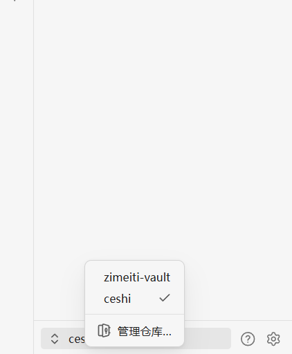
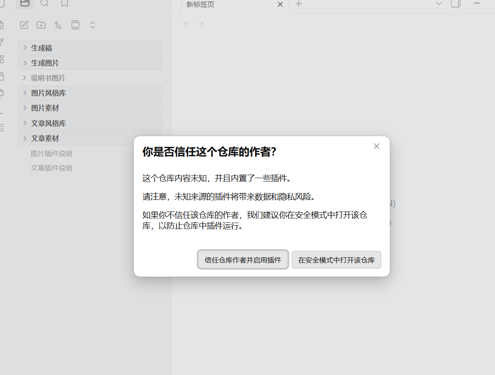
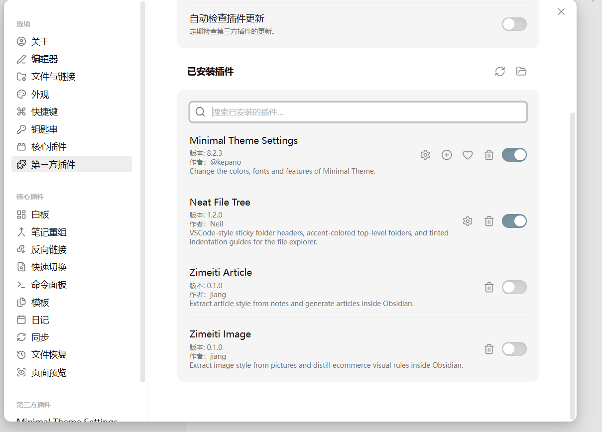
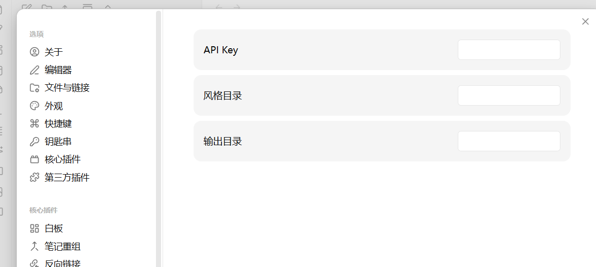
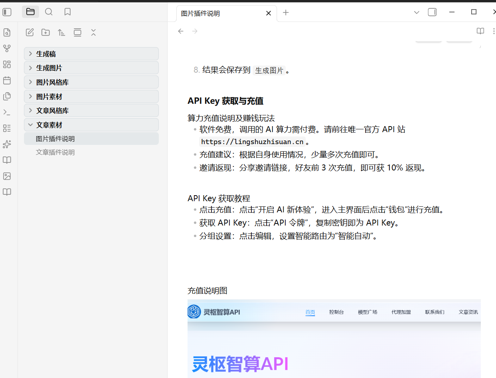

# Zimeiti Article

面向内容创作者的 Obsidian 插件，用于蒸馏对标文章风格，并基于风格生成新文章。

## 适用人群

- 公众号作者
- 小红书 / 知乎 / 博客内容创作者
- 新媒体编辑
- 需要批量提取文章风格并仿写的人

## 核心能力

- 单篇文章风格蒸馏
- 多篇文章风格蒸馏
- 基于风格生成文章
- 风格结果保存到 `文章风格库`
- 生成结果保存到 `生成稿`

## 目录约定

- `文章素材`：放待分析的参考文章
- `文章风格库`：保存蒸馏后的风格文件
- `生成稿`：保存生成结果

## 安装与启用

### 第一步：打开 Obsidian 后，点击左下角添加 Vault

选择你收到的完整 Vault 文件夹。

### 第二步：点击“信任作者”

如果 Vault 内包含插件和配置，Obsidian 会弹出安全提示。这里需要点击“信任作者”。

### 第三步：点击插件右侧按钮，开启插件

在社区插件列表中找到文章插件，点击右侧开关启用。

### 第四步：点击插件设置，输入 API Key

进入插件设置页，在 `API Key` 输入框中填入你的 Key 并保存。

### 第五步：查看插件使用说明

启用成功后，可以打开 Vault 内的文章插件说明文档查看完整流程。

## 使用方式

1. 在插件设置中填写 API Key。
2. 打开一篇或多篇文章。
3. 右键执行 `文章风格蒸馏`。
4. 输入风格名称。
5. 需要写作时，在文件夹上右键选择 `生成文章`。
6. 填写标题、需求，选择是否使用已有风格。
7. 结果会保存到 `生成稿`。

## API Key 获取与充值

- 请前往 API 站点 `https://lingshuzhisuan.cn`
- 完成充值后，在站点内获取 API Key
- 将 API Key 填入插件设置页即可使用

## Release 附件

发布版本时请在 GitHub Release 中上传以下文件：

- `main.js`
- `manifest.json`
- `styles.css`
